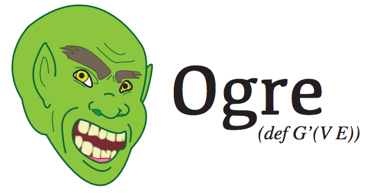

</img>

## Introduction

[Ogre](http://github.com/zmaril/ogre) is a domain specific language
for traversing property graphs in [Clojure](http://clojure.org/). Ogre
wraps [Gremlin](https://github.com/tinkerpop/gremlin/wiki), a library
which enables
[all sorts of groovy ways to work with graphs](http://gremlindocs.com/).

The documentation and samples presented here attempt to stay current
with the most current, stable release of Ogre. Please join the
[Gremlin users group](http://groups.google.com/group/gremlin-users)
for Ogre related discussions. Please use the
[Ogre issue page](https://github.com/zmaril/ogre/issues) for reporting
bugs and discussing features. For any errors or corrections with
OgreDocs, please use the
[OrgeDocs issue page](https://github.com/zmaril/ogredocs). This page
is a fork of [GremlinDocs](http://gremlindocs.com/).

Pull requests will be celebrated, scrutinized, and hopefully accepted.
If the pull request is really solid, then I'll probably [give you commit
access](http://felixge.de/2013/03/11/the-pull-request-hack.html) to
Ogre and cross my fingers. 

Ogre currently powers
[Archimedes](https://github.com/zmaril/archimedes), a Clojure library
for [Blueprints](https://github.com/tinkerpop/blueprints/wiki), and
[Hermes](https://github.com/zmaril/hermes), a Clojure library built on
top of Archimedes for working with
[Titan](http://thinkaurelius.github.com/titan/). Ogre, Archimedes, and
Hermes are all open source projects developed and maintained by
[Zack Maril](https://twitter.com/ZackMaril).

***

## Getting started

### The Tinkerpop stack

Before going down the rabbit hole, I offer the briefest of warnings:
the [Tinkerpop folks](https://github.com/tinkerpop?tab=members) have
been working on Gremlin,
[Pipes](https://github.com/tinkerpop/pipes/wiki), and
[Blueprints](https://github.com/tinkerpop/blueprints/wiki) for a few
years now and the stack has become incredibly intertwined. Ogre and
[Archimedes](https://github.com/zmaril/archimedes) try to hide all of
this from you at some hide level, but every abstraction leaks. Your
stack traces will speak of `com.tinkerpop.blueprints.Vertex` and
`com.tinkerpop.gremlin.GremlinPipeline`, and there is nothing I can
(well, should) do about it. The Tinkerpop stack is fantastic and
really well done, but I wanted to warn you that the following is just
the tip of the iceberg in terms of what you will need to know to
understand what is really going on when you use Ogre.

Thankfully, it's a joy to work with the stack. So, let's get started!

### leiningen

The version scheme for Ogre is as follows:
`[Full Gremlin version].[Ogre major version]`. Philosophically, the
authors of Gremlin are the ones who will be causing most of the
changes to Ogre to hapepn. Ogre is a mere wrapper around their work
and the version scheme acknowledges that directly. Thus, the first and
current release is `2.2.0.0`, meaning that the current release uses
Gremlin `2.2.0.0` and has undergone zero major versions itself so far
since release.

To get started with Ogre, include the following dependency for
leiningen: `[zmaril/ogre "2.2.0.0"]`.

### The TinkerGraph

Unless otherwise noted, all samples reference `ogre.tinkergraph` and
`ogre.core` as follows:

```clojure 
(require '[ogre.tinkergraph :as g]) 
(require '[ogre.core :as q]) 

(g/use-new-tinker-graph!)
```

`g/use-new-tinker-graph!` creates the following graph and secretly
squirrels it away
[_somewhere_](https://github.com/zmaril/ogre/blob/master/src/ogre/tinkergraph.clj#L10)
(image from
[here](http://github.com/tinkerpop/blueprints/wiki/Property-Graph-Model)):

</img>

I recommend that you open this image up into a
[new tab](https://github.com/tinkerpop/blueprints/raw/master/doc/images/graph-example-1.jpg).
It will serve as the main reference for the majority of the examples below. 

### So what does Ogre actually do? 

At a high level, Ogre let's you easily ask complex questions about
certain types of graphs and get back answers. That's really all it
does. 

At a low level, Ogre is a library that takes in Blueprint Vertices and
Edges and let's you build up GremlinPipeline objects that ask
questions about those objects in the language of traversals,
transformations, filters, and branching on the graph. Ogre allows you
to annotate various steps of the pipeline to allow for incredibly
useful queries in a few terse lines. Ogre also carefully deals with some of
the side effects that the Gremlin library can perform. 

At the lowest level, Ogre is probably equivalent to some crazy Turing
machine. Man, I wonder if some poor grad student has ever tried to
write the JVM as a Turing machine. Poor guy. 

### Using OgreDocs

OgreDocs is organized to be read mostly linearly. That means that you
can probably read it from start to finish and understand what is going
on. That means it starts from the basics, traversals, maps,
conversions, and filters. Then it transitions into the more advanced
topics of annotations, side effects, branching, and recipes. At the
same time, it is meant to serve as a complete reference for anyone
using the library (ctrl+f is your friend). These examples were are
developed at the command line or inside emacs with a REPL, so they are
meant to be run and experimented with.


***

## Building queries 

Ogre let's you build up Gremlin queries from scratch. The main method
for doing this is `q/query`. Here is a simple query on the
Tinkergraph. It takes in the vertex with id `1`, finds the vertices
that the starting vertex points out to, and then returns the result in
a vector.

``` clojure
(require '[ogre.tinkergraph :as g]) 
(require '[ogre.core :as q]) 

(g/use-new-tinker-graph!)

(q/query (g/find-by-id 1)
         q/-->
         q/into-vec!)
;;[#<TinkerVertex v[2]> #<TinkerVertex v[4]> #<TinkerVertex v[3]>]
```

Let's break this down: 

* `q/query` is a macro that is
  [just a combination](https://github.com/zmaril/ogre/blob/master/src/ogre/util.clj#L13)
  of `->` and `(GremlinPipeline.)`. It takes in a single element or a
  Collection and creates a new pipeline around them. 
* `g/find-by-id` is a function that goes and asks the vertex for the
  element of id 1. 
* `q/-->` is a function which adds on an outwards traversal step to
  the pipe. This means that the Gremlin query will take all the
  vertices it is currently thinking about and then look for all the
  vertices that the previous vertices pointed to. 
* `q/into-vec!` executes the query and returns the results inside of a
  vector. Up until this call, the Gremlin query hasn't actually done
  anything yet. Only when a function that ends with a bang is passed
  in does anything actually happen beyond just a GremlinPipeline
  getting built up. 

So far so good. But, I wonder, who is the dashing rogue behind
`#<TinkerVertex v[2]>`?

``` clojure
(q/query (g/find-by-id 1)
         q/-->
         q/into-vec!
         first
         ((q/prop :name)))
;;"vadas"
```

`q/query` isn't just about running Gremlin queries. Remember,
it's really just a glorified `->` with helper functions. That means we
can stick a `first` in there to get the first vertex of the vector.
`(q/prop :name)` takes a property key and returns a function which
takes a vertex and returns the given property. Thus, `"vadas"` is the
charming face of `#<TinkerVertex v[2]>`.

***

## Traversal

Traversal functions allow you to explore around the graph and see how
vertices are connected. 

### out / -->

`-->` or `out` gets the out adjacent vertices (the functions do
exactly the same thing, one just looks cooler). Additionally, labels
can be supplied that makes the graph only traverse edges with those
labels. This also applies to the other traversal functions where it
makes sense (any function that is named with arrows).

``` clojure
(q/query (g/find-by-id 4)
         q/-->
         q/into-vec!)
;;[#<TinkerVertex v[5]> #<TinkerVertex v[3]>]

(q/query (g/find-by-id 4)
         q/out
         q/into-vec!)
;;[#<TinkerVertex v[5]> #<TinkerVertex v[3]>]

(q/query (g/find-by-id 4)
         (q/--> :created)
         q/into-vec!)
;;[#<TinkerVertex v[5]> #<TinkerVertex v[3]>]

(q/query (g/find-by-id 4)
         (q/--> :hates)
         q/into-vec!)
;;[]

(q/query (g/find-by-id 4)
         (q/--> :created :hates)
         q/into-vec!)
;;[#<TinkerVertex v[5]> #<TinkerVertex v[3]>]
```

### out-edges / --E>

Gets the outgoing edges of the vertex.

``` clojure
(q/query (g/find-by-id 4)
         q/--E>
         q/into-vec!)
;;[#<TinkerEdge e[10][4-created->5]> #<TinkerEdge e[11][4-created->3]>]

(q/query (g/find-by-id 4)
         q/out-edges
         q/into-vec!)
;;[#<TinkerEdge e[10][4-created->5]> #<TinkerEdge e[11][4-created->3]>]
```

### out-vertex

Get the outgoing tail vertex of the edge.

``` clojure
(q/query (g/find-by-id 4)
         q/--E>
         q/out-vertex
         q/into-vec!)
;;[#<TinkerVertex v[4]> #<TinkerVertex v[4]>]
```

Conceptually, this might seem same strange at first. Why does it
return the same vertex twice? The answer lies in the example queries
for `--E>`. Those queries return two edges. The current query is the
same as the `--E>` query except we are asking for the `out-vertex`.
That means, by the time we are asking for the `out-vertex`, we have
two objects "in the pipeline". Thus, we get two objects back. 

### in / <--

Gets the adjacent vertices to the vertex.

``` clojure
(q/query (g/find-by-id 3)
         q/<--
         q/into-vec!)
;;[#<TinkerVertex v[1]> #<TinkerVertex v[4]> #<TinkerVertex v[6]>]
```

### in-edges / <E--

Gets the incoming edges of the vertex.

``` clojure
(q/query (g/find-by-id 3)
         q/<E--
         q/into-vec!)
;;[#<TinkerEdge e[9][1-created->3]> 
;; #<TinkerEdge e[11][4-created->3]> 
;; #<TinkerEdge e[12][6-created->3]>]
```

### in-vertex

Get incoming head vertex of the edge.
``` clojure
(q/query (g/find-by-id 3)
         q/<E--
         q/in-vertex
         q/into-vec!)
;;[#<TinkerVertex v[3]> #<TinkerVertex v[3]> #<TinkerVertex v[3]>]
```

### both / <->

Get both adjacent vertices of the vertex, the in and the out.

``` clojure
(q/query (g/find-by-id 4)
         q/<->
         q/into-vec!)
;;[#<TinkerVertex v[1]> #<TinkerVertex v[5]> #<TinkerVertex v[3]>]
```

### both-edges / `<E>`

Get both incoming and outgoing edges of the vertex.

``` clojure
(q/query (g/find-by-id 4)
         q/<E>
         q/into-vec!)
;;[#<TinkerEdge e[8][1-knows->4]> 
;; #<TinkerEdge e[10][4-created->5]> 
;; #<TinkerEdge e[11][4-created->3]>]
```

### both-vertices

Get both incoming and outgoing vertices of the edge.
``` clojure
(q/query (g/find-by-id 4)
         q/<E>
         q/both-vertices
         q/into-vec!)
;;[#<TinkerVertex v[1]> #<TinkerVertex v[4]> 
;; #<TinkerVertex v[4]> #<TinkerVertex v[5]> 
;; #<TinkerVertex v[4]> #<TinkerVertex v[3]>]
```

***

## Map

The following functions are conceptually similar in scope to
`clojure.core/map` and so are grouped together. They all take in a
function and perform some transformation on it. 

### id

Gets the unique identifier of the element.

``` clojure
(q/query (g/find-by-id 1)
         q/id
         q/into-vec!)
;;["1"]

(q/query (g/find-by-id 1)
         q/-->
         q/id
         q/into-vec!)
;;["2" "4" "3"]

(q/query (g/find-by-id 1)
         q/id
         q/-->         
         q/into-vec!)
;;ClassCastException java.lang.String cannot be cast to  com.tinkerpop.blueprints.Vertex  
;;com.tinkerpop.gremlin.pipes.transform.VerticesVerticesPipe.processNextStart 
;;(VerticesVerticesPipe.java:37)
```

### property

Get the property value of an element. 

``` clojure
(q/query (g/find-by-id 1)
         (q/property :name)
         q/into-vec!)
;;["marko"]

(q/query (g/find-by-id 1)
         q/-->
         (q/property :name)
         q/into-vec!)
;;["vadas" "josh" "lop"]
```


### label

Gets the label of an edge.

``` clojure
(q/query (g/find-by-id 1)
         (q/property :name)
         q/into-vec!)
;;["marko"]

(q/query (g/find-by-id 1)
         q/-->
         (q/property :name)
         q/into-vec!)
;;["vadas" "josh" "lop"]
``` 

### map

Gets the property map of the graph element.

``` clojure
(q/query (g/find-by-id 1)
         q/map
         q/into-vec!)
;;[#<HashMap {name=marko, age=29}>]

(q/query (g/find-by-id 1)
         q/map
         q/first-into-map!)
;;{:name "marko", :age 29}

(q/query (g/find-by-id 1)
         q/-->
         q/map
         q/all-into-maps!)
;;({:name "vadas", :age 27} {:name "josh", :age 32} {:name "lop", :lang "java"})
``` 

We now see two new functions in addition to `q/map`: `first-into-map!`
and `all-into-maps!`. As you see, Gremlin doesn't return Clojure data
structures. The new functions execute the Gremlin query and then call
the correct conversion methods to ensure that you can work with the
returned objects without too much hassle. 

### path

Gets the path through the pipeline up to this point. If functions are
provided, they are applied round robin to each of the objects in the
path. 

``` clojure
(q/query (g/find-by-id 1)
         q/<->
         q/<->
         q/path
         q/all-into-vecs!)
;; ([#<TinkerVertex v[1]> #<TinkerVertex v[2]> #<TinkerVertex v[1]>] 
;;  [#<TinkerVertex v[1]> #<TinkerVertex v[4]> #<TinkerVertex v[1]>] 
;;  [#<TinkerVertex v[1]> #<TinkerVertex v[4]> #<TinkerVertex v[5]>] 
;;  [#<TinkerVertex v[1]> #<TinkerVertex v[4]> #<TinkerVertex v[3]>] 
;;  [#<TinkerVertex v[1]> #<TinkerVertex v[3]> #<TinkerVertex v[1]>] 
;;  [#<TinkerVertex v[1]> #<TinkerVertex v[3]> #<TinkerVertex v[4]>] 
;;  [#<TinkerVertex v[1]> #<TinkerVertex v[3]> #<TinkerVertex v[6]>])         

(q/query (g/find-by-id 1)
         q/<->
         q/<->
         (q/path (q/prop :name))
         q/all-into-vecs!)
;;(["marko" "vadas" "marko"] 
;; ["marko" "josh" "marko"] 
;; ["marko" "josh" "ripple"] 
;; ["marko" "josh" "lop"] 
;; ["marko" "lop" "marko"] 
;; ["marko" "lop" "josh"] 
;; ["marko" "lop" "peter"])

(q/query (g/find-by-id 1)
         q/<->
         q/<->
         (q/path (q/prop :name) (fn [v] (count (.getProperty v "name"))))
         q/all-into-vecs!)
;;(["marko" 5 "marko"] 
;; ["marko" 4 "marko"] 
;; ["marko" 4 "ripple"] 
;; ["marko" 4 "lop"] 
;; ["marko" 3 "marko"] 
;; ["marko" 3 "josh"] 
;; ["marko" 3 "peter"])         
``` 

Note that again we have introduced a new function `all-into-vecs!`.
This function takes in an ArrayList of ArrayLists and produces a list
of vectors.

### transform

Transform applies a function to each object. 

``` clojure
(q/query (g/find-by-id 1)
         (q/transform (q/prop :name))
         q/first-of!)
;;"marko"         

(q/query (g/find-by-id 1)
          q/--E>
          q/label
          (q/transform count)
          q/into-vec!)         
;;[5 5 7]          
``` 

`first-of!` executes the query and gets the first element from the
list. Don't shoot yourself in the foot.

## Executors

Ogre cannot do everything for you. Specifically, it does not figure
out the sorts of Java objects that are returned from some arbitrary
query and convert them automatically into Clojure objects. So, with
that in mind, Ogre includes several functions that execute the
pipeline and then do conversions into Clojure data structures.


### to-list!

This is the Grand Daddy of all Executors. It calls `.toList` on the
Gremlin pipeline and gets back the list of Java objects. You probably
don't want to use this directly. 

``` clojure
(q/query (g/find-by-id 1)
         q/-->
         q/to-list!)
;;#<ArrayList [v[2], v[4], v[3]]>
``` 

### into-vec!

Gets the objects and sticks them inside of a vector. 

``` clojure
(q/query (g/find-by-id 1)
         q/-->
         q/into-vec!)
;;[#<TinkerVertex v[2]> #<TinkerVertex v[4]> #<TinkerVertex v[3]>]
``` 

### into-set!

Gets the objects and sticks them inside of a set. 

``` clojure
(q/query (g/find-by-id 1)
         q/-->         
         q/into-set!)
;;#{#<TinkerVertex v[2]> #<TinkerVertex v[3]> #<TinkerVertex v[4]>}
``` 

### first-of!

Gets the first object of the returned list. 

``` clojure
(q/query (g/find-by-id 1)
         q/first-of!)
;;#<TinkerVertex v[1]>
``` 

### first-into-vec!

Gets the first object of the returned list and puts it into a vector. 

``` clojure
(q/query (g/find-by-id 1)
         (q/property :name)
         q/path
         q/into-vec!)
;;[#<ArrayList [v[1], marko]>]         

(q/query (g/find-by-id 1)
         (q/property :name)
         q/path
         q/first-into-vec!)
;;[#<TinkerVertex v[1]> "marko"]
``` 

### first-into-set!

Gets the first object of the returned list and puts it into a set. 

``` clojure
(q/query (g/find-by-id 1)
         q/-->
         q/id
         q/gather
         q/first-into-set!)
;;#{"2" "3" "4"}         
```

### first-into-map!

Gets the first object of the returned list and puts it into a set. 

``` clojure
(q/query (g/find-by-id 1)
          q/map
          q/first-into-map)
;;{:name "marko", :age 29}
```

### all-into-vecs!

Gets the list of returned objects and maps vec across all of the
objects.

``` clojure
(q/query (g/find-by-id 1)
         q/-->
         (q/path (q/prop :age)
                 (q/prop :name))
         q/all-into-vecs!)
;;([29 "vadas"] [29 "josh"] [29 "lop"])
```                        

### all-into-sets!

Gets the list of returned objects and maps set across all of the
objects.

``` clojure
(q/query (g/find-by-id 1)
         q/-->
         (q/path (q/prop :age)
                 (q/prop :name))
         q/all-into-sets!)
;;(#{"vadas" 29} #{"josh" 29} #{"lop" 29})
```                        

### all-into-maps!

Gets the list of returned objects and maps set across all of the
objects.

``` clojure
(q/query (g/find-by-id 1)
         q/<->
         q/<->
         q/map
         q/all-into-maps!)
;; ({:name "marko", :age 29} 
;;  {:name "marko", :age 29} 
;;  {:name "ripple", :lang "java"} 
;;  {:name "lop", :lang "java"} 
;;  {:name "marko", :age 29} 
;;  {:name "josh", :age 32} 
;;  {:name "peter", :age 35})         
```                        

***
## Reduce

These functions sort of act like `clojure.core/reduce`.

### order

Order the items in the stream according to the provided function. If no
function is provided, then a default sort order is used.

```clojure
(q/query (g/get-vertices)
         (q/property :name)
         q/into-vec!)                         
;;["lop" "vadas" "marko" "peter" "ripple" "josh"]

(q/query (g/get-vertices)
         (q/property :name)
         q/order
         q/into-vec!)                         
;;["josh" "lop" "marko" "peter" "ripple" "vadas"]         

(q/query (g/get-vertices)
         (q/property :name)
         (q/order (fn [a b] (compare b a)))
         q/into-vec!)                         
["vadas" "ripple" "peter" "marko" "lop" "josh"]
```

### gather

Collect all objects up to that step and process the gathered list with
the provided closure.

``` clojure
(q/query (g/find-by-id 1)
         q/-->
         q/id
         q/gather
         q/first-into-vec!)
;;["2" "3" "4"]         

(q/query (g/find-by-id 1)
         q/-->
         q/id
         (q/gather count)
         q/into-vec!)
;;3
```

*** 

## Filter

Filter steps decide whether to allow an object to pass to the next
step or not.

### range

A range filter that emits the objects within a range.

``` clojure 
(q/query (g/find-by-id 1)
         (q/-->)
         (q/into-vec!))
;;[#<TinkerVertex v[2]> #<TinkerVertex v[4]> #<TinkerVertex v[3]>]         


(q/query (g/find-by-id 1)
         (q/-->)
         (q/range 0 1)
         (q/into-vec!))
;;[#<TinkerVertex v[2]> #<TinkerVertex v[4]>]         
```

### dedup

Filter out repeated objects. A function can be supplied that provides
the values that the pipeline will consider when filtering 

``` clojure
(q/query (g/get-vertices)
         q/<->
         (q/property :name)
         (q/into-vec!))         
;;["marko" "josh" "peter" "marko" "vadas" "josh" "lop" "lop" "josh" "marko" "ripple" "lop"]

(q/query (g/get-vertices)
         q/<->
         q/dedup
         (q/property :name)
         (q/into-vec!))
;;["marko" "josh" "peter" "vadas" "lop" "ripple"]                         

(q/query (g/get-vertices)
          q/<->
          (q/dedup (partial g/get-property :lang))
          (q/property :name)
          (q/into-vec!))
;;["marko" "lop"]          
```                         

`g/get-vertices` retrieves all of the vertices of the graph and
provides them in a list. 

### except

Filter out the provided objects.

``` clojure
(q/query (g/find-by-id 1)
         q/-->
         q/<--
         (q/except [(g/find-by-id 1)])
         (q/into-vec!))         
;;[#<TinkerVertex v[4]> #<TinkerVertex v[6]>]         
```                         

### filter

Decide whether to allow an object to pass. Return true from the
closure to allow an object to pass.


``` clojure
(q/query (g/get-vertices)
         (q/filter (fn [v] (= "java" (.getProperty v "lang"))))
         q/map
         (q/all-into-maps!))         
;;({:name "lop", :lang "java"} {:name "ripple", :lang "java"})         
```                         


### has

Allows an element if it has a particular property. The standard
Clojure operations for comparisons can also be supplied:
`>`,`>=`,`<`,`<=`,`=`,`not=`.

```clojure
(q/query (g/get-vertices)
         (q/has :name "marko")                    
         (q/into-vec!))
;;[#<TinkerVertex v[1]>]         

(q/query (g/get-vertices)
         (q/has :age > (int 30))                    
         (q/into-vec!))
[#<TinkerVertex v[6]> #<TinkerVertex v[4]>]         
```                      

### has-not

Allows an element if it does not have a particular property. 

```clojure
(q/query (g/get-vertices)
         (q/has-not :name "marko")                    
         (q/into-vec!))
;;[#<TinkerVertex v[3]> #<TinkerVertex v[2]> 
;; #<TinkerVertex v[6]> #<TinkerVertex v[5]> 
;; #<TinkerVertex v[4]>]

(q/query (g/get-vertices)
         (q/has-not :age > (int 30))                    
         (q/into-vec!))
;;[#<TinkerVertex v[2]> #<TinkerVertex v[1]>]         
```                      

### interval

Allow elements to pass that have their property in the provided start
and end interval.

```clojure
(q/query (g/find-by-id 1)
         (q/--E>)
         (q/interval :weight 0 0.6)
         (q/in-vertex)
         (q/into-vec!))
;;[#<TinkerVertex v[2]> #<TinkerVertex v[3]>]         
```         
### random

Emits the incoming objects, each with the supplied chance.

```clojure
;; Results will vary
(q/query (g/get-vertices)
         (q/random 0.5)
         (q/into-vec!))
[#<TinkerVertex v[6]> #<TinkerVertex v[4]>]

(q/query (g/get-vertices)
         (q/random 0.5)
         (q/into-vec!))
;; Results will vary
[#<TinkerVertex v[3]> #<TinkerVertex v[1]> #<TinkerVertex v[6]> #<TinkerVertex v[4]>]
```
### retain

Allow everything to pass except what is not in the supplied
collection.

```clojure
(q/query (g/find-by-id 1)
         (q/-->)      
         (q/retain [(g/find-by-id 2)])
         (q/into-vec!))
;;[#<TinkerVertex v[2]>]         
```

## Annotations

So far, we've had great success traversing the graph. If you've
understood most of everything up to this point, you know how to do
sorts of neat things with graphs. There's another level of traversal
that we can attain though. We can annotate and traverse the pipeline
itself, which lets us do all sorts of fancy tricks. 


### back

Go back to the results from n-steps ago.

```
(q/query (g/find-by-id 1)
         q/-->      
         (q/back 1) 
         q/into-vec!)
;;[#<TinkerVertex v[1]>]
```

### as/back-to

`as` lets you name a step that you can later return to with `back-to`. 

```
(q/query (g/find-by-id 1)
         (q/as "here")
         q/-->      
         (q/back-to "here")         
         q/into-vec!)
;;[#<TinkerVertex v[1]>]         
```


### select

Get a list of named steps, with optional functions for post processing
round robin style. (This will be returned as a map when Pipes is
upgraded to 2.3.0).

```clojure
(q/query (g/find-by-id 1)
         (q/as "a")
         (q/--> :knows)
         (q/as "b")
         q/select
         q/all-into-vecs!)
;;([#<TinkerVertex v[1]> #<TinkerVertex v[2]>] 
;; [#<TinkerVertex v[1]> #<TinkerVertex v[4]>])         

(q/query (g/find-by-id 1)
         (q/as "a")
         (q/--> :knows)
         (q/as "b")
         (q/select (q/prop :name))
         q/all-into-vecs!)
;;(["marko" "vadas"] ["marko" "josh"])

(q/query (g/find-by-id 1)
         (q/as "a")
         (q/--> :knows)
         (q/as "b")
         (q/select (q/prop :name) g/get-id)
         q/all-into-vecs!)
;;(["marko" "2"] ["marko" "4"])
```

### select-only

Select the named steps to emit, with round robin style function
processing again. 

```clojure
(q/query (g/find-by-id 1)
         (q/as "a")
         q/-->
         (q/as "b")
         q/-->
         (q/as "c")       
         (q/select-only ["a" "b"])
         q/all-into-vecs!)
;;([#<TinkerVertex v[1]> #<TinkerVertex v[4]>] 
;; [#<TinkerVertex v[1]> #<TinkerVertex v[4]>])

(q/query (g/find-by-id 1)
         (q/as "a")
         q/-->
         (q/as "b")
         q/-->
         (q/as "c")       
         (q/select-only ["a" "c"] (q/prop :name))
         q/all-into-vecs!)
;;(["marko" "ripple"] ["marko" "lop"])

(q/query (g/find-by-id 1)
         (q/as "a")
         (q/--> :knows)
         (q/as "b")
         q/-->
         (q/as "c")                
         (q/select-only ["a" "c"] (q/prop :name) g/get-id)
         q/all-into-vecs!)
;;(["marko" "5"] ["marko" "3"])
```

### loop

Loop over a particular set of steps in the pipeline. The first
argument is the number of steps back. The second argument is a
predicate that takes three objects: the current object, the current
path, and the number of loops thus far. While the predicate evaluates
true, the loop continues on it's merry way. 

```clojure
(q/query (g/find-by-id 1)
         (q/-->)
         (q/loop 1
                 (fn [l o p] (< l 3)))
         (q/property :name)
         (q/into-vec!))                           
;;["ripple" "lop"]
```                  
                
### loop-to

`loop-to` is just like loop, but it travels back to a named step
instead. 

```clojure
(q/query (g/find-by-id 1)
         (q/as "here")
         (q/-->)
         (q/loop-to "here"
                 (fn [l o p] (< l 3)))
         (q/property :name)
         (q/into-vec!))                           
;;["ripple" "lop"]
```                  

*** 

## Side Effect

As this stage in Ogre's development, most side effect steps immediately
return various data structures about the query. 

### get-grouped-by

Takes in a key function and processing function. Returns all of the
processed objects grouped by the value of the key function.

```clojure
(q/query (g/get-vertices)
         (q/get-grouped-by! (q/prop :lang)
                            identity))
;;{nil [#<TinkerVertex v[2]> #<TinkerVertex v[1]> 
;;      #<TinkerVertex v[6]> #<TinkerVertex v[4]>], 
;;"java" [#<TinkerVertex v[3]> #<TinkerVertex v[5]>]}

(q/query (g/get-vertices)
         (q/get-grouped-by! (q/prop :lang)
                            (q/prop :name)))
;;{nil ["vadas" "marko" "peter" "josh"], "java" ["lop" "ripple"]}


(q/query (g/get-vertices)
         (q/get-grouped-by! (q/prop :lang)
                            #(q/query % q/out q/into-vec!)))
;;{nil [[] 
;;      [#<TinkerVertex v[2]> #<TinkerVertex v[4]> #<TinkerVertex v[3]>]
;;      [#<TinkerVertex v[3]>] 
;;      [#<TinkerVertex v[5]> #<TinkerVertex v[3]>]], 
;;      "java" [[] []]}
```

### get-group-count!

Takes in a key function, and optionally, a counting function. Returns
the count of the objects grouped by the key function.

```clojure 
(q/query (g/get-vertices)
         (q/get-group-count! (q/prop :lang)))
;;{nil 4, "java" 2}
(q/query (g/get-vertices)
         (q/get-group-count! (q/prop :lang)
                             (fn [a b] (+ b (count (.getProperty a "name"))))))
;;{nil 19, "java" 9}
```

### get-table!

Returns a list of maps that correspond to the values of the named
steps. Optional arguments are a list of functions that are applied
round robin style.

```clojure 
(q/query (g/get-vertices)
         (q/property :name)
         (q/as "name")
         (q/back 1)
         (q/property :age)
         (q/as "age")
         (q/get-table!))
;;({:name "lop", :age nil} {:name "vadas", :age 27} 
;; {:name "marko", :age 29} {:name "peter", :age 35} 
;; {:name "ripple", :age nil} {:name "josh", :age 32})         

(q/query (g/get-vertices)
         (q/property :name)
         (q/as "name")
         (q/back 1)
         (q/property :age)
         (q/as "age")
         (q/get-table! count #(or % 18)))
;;({:name 3, :age 18} {:name 5, :age 27} 
;; {:name 5, :age 29} {:name 5, :age 35} 
;; {:name 6, :age 18} {:name 4, :age 32})
```

### get-tree!

Returns a tree of the objects encountered taken while executing the query. Key
functions can be supplied as well. 

```clojure
(q/query (g/find-by-id 1)
         q/-->
         q/-->
         (q/get-tree! (q/prop :name)))
{:value "marko", 
 :children [{:value "josh", 
             :children [{:value "lop"} 
                        {:value "ripple"}]}]}         
```

### side-effect

Let's you execute some side effect. 

```clojure
(let [lst (atom [])
      elem (g/find-by-id 1)
      names (q/query elem
                  q/-->
                  (q/side-effect (partial swap! lst conj))
                  (q/property :name)
                  q/into-vec!)]
      [@lst names])
;;[[#<TinkerVertex v[2]> #<TinkerVertex v[4]> #<TinkerVertex v[3]>] 
;; ["vadas" "josh" "lop"]]      
```

*** 

## Summary

Ogre let's you effectively query graphs. It's a young library
built on top of a solid stack. If you are looking for a way to create
and store these graphs from within Clojure, you should check out
[Hermes](https://github.com/zmaril/hermes).
